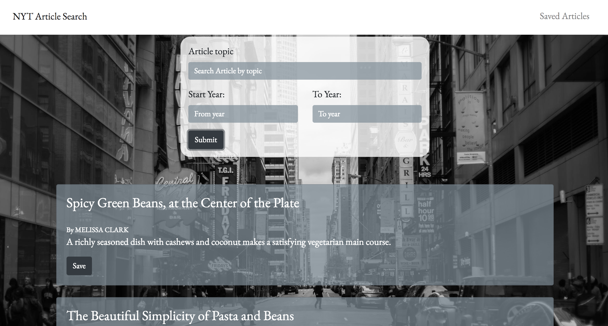

# New York Times Article Search

A React.js app that allows users to for articles in the New York Times. After searching a topic, the app displays the related articles with a save option. Sending the relevent data to the database to be retrieved when visiting the saved page. The users are able to delete the articles from the saved page. If there are no articles associated with the topic, a message is diplayed informing the user that there are no articles related to the topic. The app uses Node/Express for the server and routing, MongoDB/Mongoose for the database and React on the client side.

[Live Link](https://becoskie-nyt.herokuapp.com/)


### The Build


1. express
2. mongoose
3. body-parser
4. axios
5. moment
6. react
7. react-dom
8. react-router-dom
9. react-scripts


Run the following from the root  *and* from the Client folder:

```
yarn install
```


## Screenshots

**Article search and results**



### You know what goes good with NY Times? 
<a class="bmc-button" target="_blank" href="https://www.buymeacoffee.com/mwFGJN9bZ"></a>